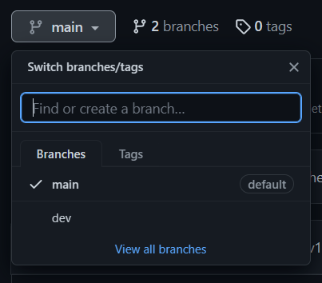

# **CONTRIBUTION GUIDELINES**

## SETTING UP
To contribute to this repo, you'll first need to [Fork](https://github.com/JunDevHarsh/ReadmeEase/fork) this repo, on the top right of your screen.


Once you've forked the repo, create a new branch called `dev`.
This is where you'll be pushing your changes to be reviewed.



## **NAMING GUIDELINES**
- **Folders**
    - Should be in lowercase. e.g `src`, `assets`.

- **Files**
    - Should be in lowercase. e.g `example.css`.

- **Markdown (`.md`)**
    - Should be capitalized. e.g `README.md`, `CONTRIBUTION.md`
- *Separate words using underscores*(`_`) e.g `my_folder`, `my_file.txt`, `MY_DOCS.md`.

## **COMMIT MESSAGE GUIDELINES**
- MESSAGE STRUCTURE
    ```
    [type]: Subject

    body (optional)

    footer (optional)
    ```
- THE TYPE

    - The type is contained within the title and can be one of these types:

        - **feat**: A new feature
        - **fix**: A bug fix
        - **docs**: Changes to documentation
        - **style**: Formatting, missing semi colons, etc; no code change
        - **refactor**: Refactoring production code
        - **test**: Adding tests, refactoring test; no production code change
        - **chore**: Updating build tasks, package manager configs, etc; no production code change

- THE SUBJECT

    - Subjects should be no greater than 50 characters, should begin with a capital letter and do not end with a period.

    - Use an imperative tone to describe what a commit does, rather than what it did. For example, use change; not changed or changes.

- THE BODY

    - Not all commits are complex enough to warrant a body, therefore it is optional and only used when a commit requires a bit of explanation and context. Use the body to explain the what and why of a commit, not the how.
    - When writing a body, the blank line between the title and the body is required and you should limit the length of each line to no more than 72 characters.

- THE FOOTER
    - The footer is optional and is used to reference issue tracker IDs.

- **Example Commit Message**
```
feat: Summarize changes in around 50 characters or less

More detailed explanatory text, if necessary. Wrap it to about 72
characters or so. In some contexts, the first line is treated as the
subject of the commit and the rest of the text as the body. The
blank line separating the summary from the body is critical (unless
you omit the body entirely); various tools like `log`, `shortlog`
and `rebase` can get confused if you run the two together.

Explain the problem that this commit is solving. Focus on why you
are making this change as opposed to how (the code explains that).
Are there side effects or other unintuitive consequences of this
change? Here's the place to explain them.

Further paragraphs come after blank lines.

 - Bullet points are okay, too

 - Typically a hyphen or asterisk is used for the bullet, preceded
   by a single space, with blank lines in between, but conventions
   vary here

If you use an issue tracker, put references to them at the bottom,
like this:

Resolves: #123
See also: #456, #789
```