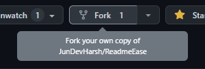
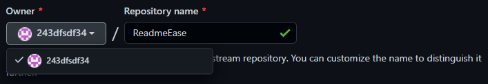
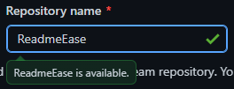
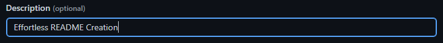
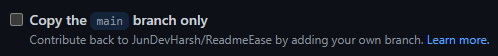
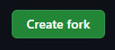

# ReadmeEase &middot; [](/LICENSE)

**ReadmeEase** is a cutting-edge platform designed to simplify the creation of high-quality README files. Users can easily design and customize their README files with ease. The platform is built using Next.js and Tailwind CSS, offering a fast, responsive, and visually appealing experience.

## How to fork the repository

1. In the top-right corner of the repository page, click **Fork**.

   

2. Select an owner for the forked repository.

   

3. By default, forks are named the same as their upstream repositories. You can change the name of the fork to distinguish it further.

   

4. Optionally, add a description of your fork.

   

5. Uncheck this option to copy all branches to the new fork.


   

   > By unchecking this option will download all the branches of the repository including `dev` branch also. So that you cannot miss any changes related to the `dev` branch.

6. Click **Create fork**.

   

Now you have successfully forked the repository.

## Run Locally

1. [Fork](https://github.com/JunDevHarsh/ReadmeEase/fork) the repository by following steps mentioned in `How to fork the repository` section.

2. Type the following command in the terminal.

   ```bash
   git clone https://github.com/<your-username>/<repository-name>.git
   ```

3. Go to the project's directory.

   ```bash
   cd ReadmeEase
   ```

4. Install dependencies.

   ```bash
   npm install
   or
   npm i
   ```

5. Start the server.

   ```bash
   npm run dev
   ```

## Tech Stack

**Client:** [Next.js](https://nextjs.org/), [TailwindCss](https://tailwindcss.com/)

## Author

- [JunDevHarsh](https://www.github.com/JunDevHarsh)

## Contributing

Contribution to `ReadmeEase` is a great way to get involved in the open-source community and make a positive impact on the development of new technologies. As a contributor, you will have the opportunity to work with a diverse group of developers from around the world and gain valuable experience in software development. You can contribute to the project in a variety of ways, such as:

- Submitting bug reports and feature requests by raising an [issue](https://github.com/JunDevHarsh/ReadmeEase/issues/new)
- Writing documentation
- Improving the user interface and user experience
- Adding new features and functionality
- Fixing bugs and improving code quality

**Note**: <span id="pr-note" name="pr-note">Please make sure to create pull requests to the `dev` branch only for any changes that need to be developed and tested. The `main` branch is reserved for production-ready code and should not be used for development.</span>

By contributing to the `ReadmeEase`, you will not only be helping to improve the platform, but also contributing to the growth and success of open-source projects hosted on GitHub.